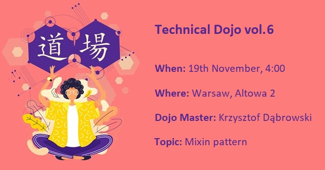
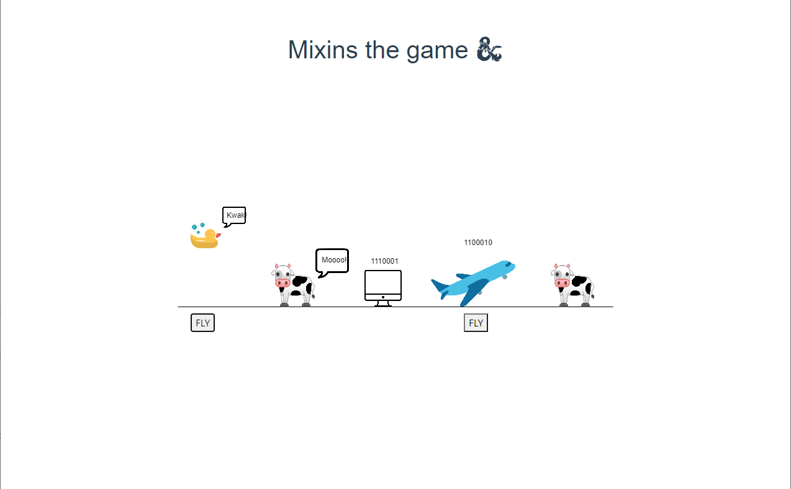

# Mixins presentation

On the 19th of November 2021, I've given a presentation on the topic of the Mixin pattern. This event was a part of a cyclic, internal Technical Dojo initiative at Predica.

For this purpose, I've prepared a PowerPoint presentation and a small game-like demo written in TypeScript using the p5 graphics library.

Screen from the game  

